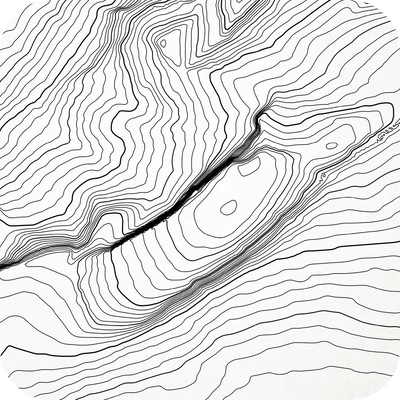

# Mt. Choc

    

Mt. Choc is a low-profile 65% ~dark chocolate~ keyboard.

## News
🦗

## Gallery
🦗

## Layout
Mt. Choc's 65% layout is designed around Kailh Choc V1 (PG1350) switches and choc-spaced keycaps (18mm wide x 17mm tall, like [MBK Legend‡ Extended](https://fkcaps.com/keycaps/mbk/legend-extended)). The rows have the standard stagger and 6.25U spacebar. The right column is a tad narrower than usual with the intention of reducing the number of stabilizers needed. Hence, the backspace is 1.5U, the forward slash is 1U, enter is 1.75U and the right shift is 2.25U (symmetric with the left shift). The arrow cluster is offset 0.25U to right-align with the microcontroller and display. The layout does look simillar to 68-key boards like  the [Ikki68 Aurora](https://shop.wuquestudio.com/pages/ikki68-aurora) or [Varmillo Miya or VA68](https://en.varmilo.com/keyboardproscenium/product_indexsubject?layout=65&model=Theme%20keyboard), with the 2x2 keys in the top-right swapped for the display. The design is very human.

The 2.25U shift on the left and right will need choc 2U stabilizers (standard 24mm wire). The 6.25U MBK spacebar needs a 100mm wire, which is the same width as a MX wire. However, the default long wire that comes along with a Kailh Choc stabilizer kit is 76mm long.

    

## Hardware
The board is powered by a [Waveshare RP2040 microcontroller](https://www.waveshare.com/rp2040-lcd-1.28.htm) board with integrated 1.28" display. 

## Firmware
The [Waveshare-RP2040-LCD-1.28](https://circuitpython.org/board/waveshare_rp2040_lcd_1_28/) is now supported by CircuitPython, as of the 8.0.0 release. Mt. Choc uses [KMK](http://kmkfw.io/) for firmware, same as [Purple Owl](https://github.com/SonalPinto/purple-owl).

## Build

### Minimalist Stack
🦗

### 3D Printed Case
🦗

## Misc
- Keyboard Layout Editor - [link](http://www.keyboard-layout-editor.com/#/gists/bee63da1aabd22d248c2b8acba987245)
- KLE raw txt - [link](docs/mt-choc-kle.txt)
- Kailh choc stabilizer spec - [link1](https://github.com/keebio/keebio-references/tree/master/Kailh%20Choc%20Stabs), [link2](assets/choc-stab-spec.jpg), [3D model](https://grabcad.com/library/kailh-choc-v1-pg1350-stabilizer-1)
- Kailh choc PG1350 spec - [link](https://cdn-shop.adafruit.com/product-files/5113/CHOC+keyswitch_Kailh-CPG135001D01_C400229.pdf)
- Kailh choc hotswap socket - [link](https://cdn-shop.adafruit.com/product-files/5118/5118-Choc-Socket.pdf)
- [ChosFox CFX](https://chosfox.com/products/chocfox-legends-keycap-set?variant=42753190461634) keycaps appear to be designed for a 1U=19x19 layout, at least according my calculations. So, the non-1U keys will not align along the right or left column.

## Credits
- Simon ([FK Caps](https://fkcaps.com/)) and folks on FK Caps [Discord](https://discord.gg/b5C9H99RYZ)
