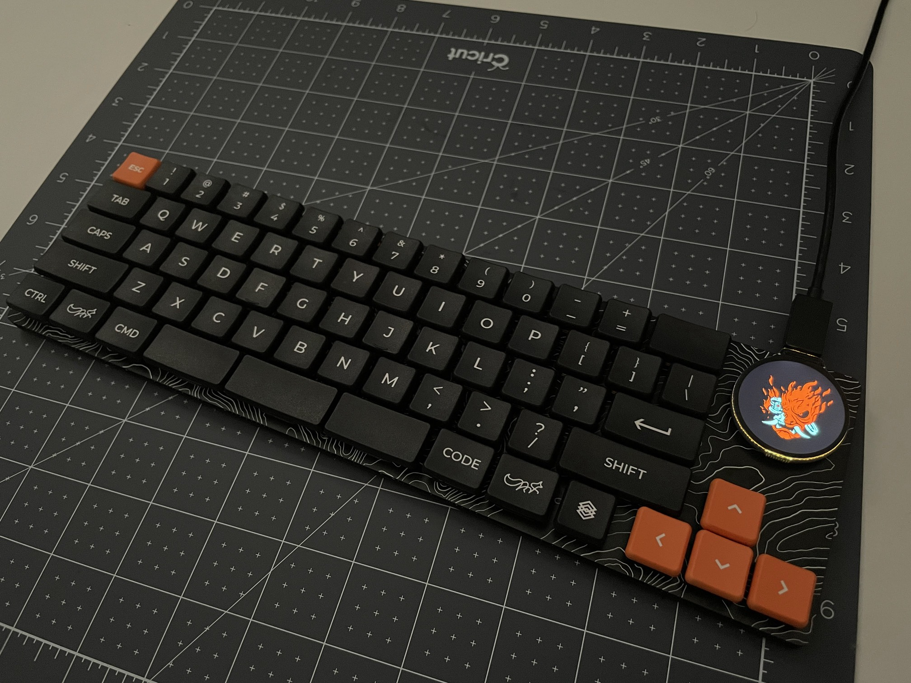
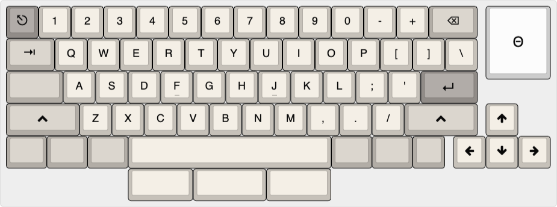

# Mt. Choc

    

Mt. Choc is a low-profile 65% ~dark chocolate~ keyboard with a digital pin badge.

## News
🦗

## Gallery

    

    

    

    

https://user-images.githubusercontent.com/8972905/226076137-39ad3e6d-f04e-4504-a3f6-302d70fa951c.mp4

## Layout
A while back I had bought a box of [Sunset tactiles](https://lowprokb.ca/collections/keyboards/products/sunset-tactile-choc-switches) on a whim. I didn't really have a board in mind back then, but I knew I wanted to design a low profile board and have some kinda display on it. I had some idea brewing around since reading this ["Cyberpunk OLED glitch"](https://kbd.news/Cyberpunk-OLED-glitch-1098.html) article on KBD.news. A few weeks later, I stumbled upon [Simon's interview](https://kbd.news/Keycaps-design-and-free-kittens-1801.html) on KBD.news and saw the interest check for [MBK Legend‡ Extended](https://fkcaps.com/keycaps/mbk/legend-extended)). Everything just clicked together, and I started drafting a board.

Mt. Choc's 65% layout is designed around Kailh Choc V1 (PG1350) switches and choc-spaced keycaps (18mm wide x 17mm tall, like MBK Legend‡ Extended). The rows have the standard stagger and 6.25U spacebar. The right column is a tad narrower than usual with the intention of reducing the number of stabilizers needed. Hence, the backspace is 1.5U, the forward slash is 1U, enter is 1.75U and the right shift is 2.25U (symmetric with the left shift). The arrow cluster is offset 0.25U to right-align with the microcontroller and display. The layout does look simillar to 68-key boards like  the [Ikki68 Aurora](https://shop.wuquestudio.com/pages/ikki68-aurora) or [Varmillo Miya or VA68](https://en.varmilo.com/keyboardproscenium/product_indexsubject?layout=65&model=Theme%20keyboard), with the 2x2 keys in the top-right swapped for the display. The design is very human.

    

The 2.25U shift on the left and right will need choc 2U stabilizers (standard 24mm wire). The 6.25U MBK spacebar uses a stabilizer that is 100mm apart (MBK spec). Opportunistically, the layout also offers an alternate spacebar layout with a split (2U-2.25U-2U) that reuses the stabilizer footprint cutouts of the 6.25U (read more in the [hardware doc](docs/hardware.md)).

With the split spacebar layout, you are left with 2U and 2.25U that use stabilizers. You could brave a build without stabilizers for these, and see where that takes you. The MX-spaced [wrk keycaps](https://worklouder.cc/keycaps/) do not appear to be using stabilizers for their 2U. I've tried this, and I wasn't a fan. So, I recommend using stabilizers for anything over 2U.

Lastly, the [round display](https://www.waveshare.com/wiki/RP2040-LCD-1.28) is like a digital pin badge for your keyboard. Give it a personal flair!

    

## Hardware
[⌨️ DOC ⌨️](docs/hardware.md)

## Build
[⌨️ DOC ⌨️](docs/build.md)

## Firmware
[⌨️ DOC ⌨️](docs/firmware.md)

## Misc
- Keyboard Layout Editor - [link](http://www.keyboard-layout-editor.com/#/gists/bee63da1aabd22d248c2b8acba987245)
- KLE raw txt - [link](docs/mt-choc-kle.txt)
- Kailh choc stabilizer spec - [link1](https://github.com/keebio/keebio-references/tree/master/Kailh%20Choc%20Stabs), [link2](assets/choc-stab-spec.jpg), [3D model](https://grabcad.com/library/kailh-choc-v1-pg1350-stabilizer-1)
- Kailh choc PG1350 spec - [link](https://cdn-shop.adafruit.com/product-files/5113/CHOC+keyswitch_Kailh-CPG135001D01_C400229.pdf)
- Kailh choc hotswap socket - [link](https://cdn-shop.adafruit.com/product-files/5118/5118-Choc-Socket.pdf)

### Compatible Keycaps
Keycaps designed for 18mm wide 1U. This is not an exhaustive list.
- [MBK Legend‡ Extended](https://fkcaps.com/keycaps/mbk/legend-extended)
- [MBK Convex POM](https://www.moergo.com/collections/mbk-convex-keycaps/products/mbk-pom-pk2?variant=44253211722001). The 2U and 2.25U would be well suited for the split spacebar. Note, this is not the same as FK Caps MBK.
- [MCC keycaps](https://splitkb.com/products/moergo-mcc-profile-1u-keycap)
- [ChosFox CFX](https://chosfox.com/products/chocfox-legends-keycap-set?variant=42753190461634). Ok, technically, I am not sure if CFX was designed for 18mm wide spacing. My measurements say that they may have been designed for 19mm (or 19.05mm) spacing. However, when placed on the 18mm wide spaced board, I couldn't tell if anything was off (at least the left/right mod columns appear ok~ish).

## Credits
- Simon ([FK Caps](https://fkcaps.com/)) and folks on FK Caps [Discord](https://discord.gg/b5C9H99RYZ)
- skarrman's [Horizon keyboard](https://github.com/skarrmann/horizon/)
- FK Caps [mbk-footprints](https://github.com/FKcaps/mbk-footprints)
  - Based off of nicoles' [mbk-footprints](https://github.com/nicoles/mbk_footprints)
- Wife for photography and coming up with the name
