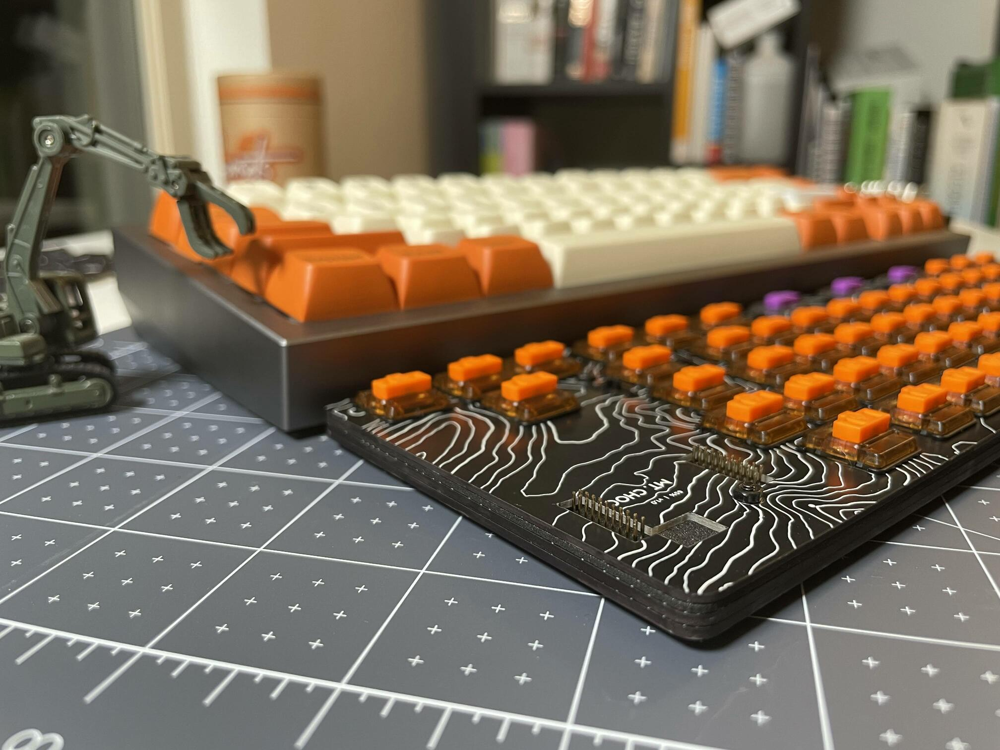

# Build

At the least the build requires the main pcb and the switch plate. This can either be housed naked in the minimalist stack with a component enclosing bottom plate or a 3D printed case for a more enclosed look.

> Note: Vendors are only examples or recommendations. Not endorsing them one way or the other. No affiliations with them.

| Part | Quantity | Description |
| -------------| ------------ | ------------- |
| Main PCB  | 1 | [gerbers](https://github.com/SonalPinto/mt-choc/tree/main/pcb/v1.0/fab/main), 1.6mm PCB  |
| Switch Plate  | 1 | [gerbers](https://github.com/SonalPinto/mt-choc/tree/main/pcb/v1.0/fab/top), 1.2mm PCB  |
| RP2040-LCD-1.28 | 1 | [waveshare](https://www.waveshare.com/rp2040-lcd-1.28.htm) |
| Male Headers | 2 | [amazon](https://www.amazon.com/dp/B07WHZ2XKK?psc=1&ref=ppx_yo2ov_dt_b_product_details), 2x10 1.27mm pitch |
| Diodes | 66 | [adafruit](https://www.adafruit.com/product/5099), 1N4148 SOD-123 package |
| Kailh Choc hotswap sockets | 66 | [adafruit](https://www.adafruit.com/product/5118) |

#### Notes
- The switch plate should be a 1.2mm PCB order so that the choc switches and stabs slot in correctly.
- PCB can be ordered from fabs like [JLCPCB](https://jlcpcb.com/).
  - You may be charged a little extra ($7.5) for the switch plate for "having too many cutouts", i.e. a [routing fee](https://support.jlcpcb.com/article/62-what-cases-will-be-charged-of-extra-cost).

### Minimalist Stack
For a minimalist look, throw in the bottom plate and foam mid-layer. The bottom plate will enclose the components of the main PCB and the foam layer will fill in the 1mm gap between the switch plate and the main PCB. The bottom plate needn't be a PCB, and can be laser cut with 2mm acrylic as well, same as the foam.

    

| Part | Quantity | Description |
| -------------| ------------ | ------------- |
| Bottom Plate  | 1 | [gerbers](https://github.com/SonalPinto/mt-choc/tree/main/pcb/v1.0/fab/bottom), 1.6mm PCB  |
| Mid Plate  | 1 | [DXF](https://github.com/SonalPinto/mt-choc/tree/main/case/minimalist/mid-plate.dxf), [amazon](https://www.amazon.com/dp/B09NB56KPH?psc=1&ref=ppx_yo2ov_dt_b_product_details), 1mm EVA foam, laser cut  |
| M2 Screws | 5 | 8mm, preferably flat head, [amazon](https://www.amazon.com/gp/product/B07TDHZJLL/ref=ppx_yo_dt_b_asin_title_o03_s01?ie=UTF8&psc=1) |
| M2 Nuts | 5 | [amazon](https://www.amazon.com/gp/product/B09ZHHSY92/ref=ppx_yo_dt_b_asin_title_o03_s01?ie=UTF8&psc=1) |

#### Notes
- The mid-plate DXF is exact, i.e. dimensions match the main PCB and switch plate. However, the kerf of the laser can cut way more material (like maybe 1mm) with soft foam like EVA. So, if using foam for the mid-plate, then account for that and use a lower power run. As well, grow the outer shape, and then once assembled cut the excess with an xacto knife.
- There are no holes for the screws in the mid-plate. With foam, you can just poke through it with a pin, and then set the screw.

    

#### Assembly
- Solder up the main PCB, and confirm everything works as you go along. [Do read this](https://github.com/SonalPinto/mt-choc/blob/main/docs/hardware.md#soldering).
- Lube the choc stabs and set them into the switch plate - [instructions](https://docs.keeb.io/choc-stabs).
- Setup the 4 layers, and fix them with the screws/nuts.
- Screws are driven in from the bottom. The nuts will be more or less hidden under the keycaps.
- Mount the switches while supporting the sockets from the back, to make sure they don't get ripped off the pads while pushing the socket in.
- Use a sharpie to darken the sides of the PCB.

### 3D Printed Case
- TODO
