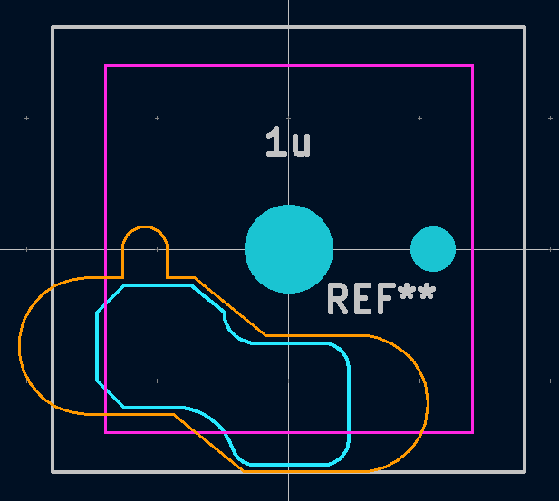

# Hardware

The **minimalist** build for Mt. Choc is inspired by the "PCB-Enclosed" design of the [Horizon Keyboard](https://github.com/skarrmann/horizon/), where the main PCB is enclosed by a another PCB with cutouts for the components. This builds for an excitingly low height stack!

    

## Microcontroller
The board is powered by a [Waveshare RP2040 microcontroller](https://www.waveshare.com/rp2040-lcd-1.28.htm) with integrated 1.28" display (GC9A01A, 240x240px). The board has two 2x10 headers (1.27mm pitch) with a decent number of GPIO brought out. I picked this one because the display seemed fun, and the overall profile is pretty neat, and for the RP2040.

Since I couldn't find a footprint for this board, I had to draw one. The footprint base for the uC was extracted from the model linked in its [waveshare docs](https://www.waveshare.com/wiki/RP2040-LCD-1.28). Then, project the model onto an offset plane and export the sketch as DXF. This can be imported in KiCad Footprint Editor as a graphic for further cleanup.

    

The uC has footprints for all the three layers. The main PCB is the one with the soldered through-hole male headers (two 2x10 1.27mm pitch). So, the bottom will need some cutout for the pins and pads. The switch plate cutouts has clearances for the female headers on the uC and the MX1.25 battery header. The buttons and the USBC header have enough clearance above the switch plate to not require cutouts. However, I've also added a footprint for a larger cutout following the outer profile in the [library](../pcb/footprints/mt-choc-footprints.pretty), though I haven't used it in this design. The edge.cuts are in orange, below.

    

## Stabilizers
The choc keycaps that need stabilizers (and wish to use Kailh Choc Stabilizers) apparently have an orientation, because the stabilizer stems ("+") and the switch do not sit in a straight line (Fig. 1). The footprint confirms this as well (Fig. 2). Moreover, the stabilizer itself cannot be moved to be collinear with the switch because there is not enough room to move the stabilizer wire down (Fig. 3).

    

Now, usually for blanks this wouldn't be a problem. However, with legends, the keycaps need to sit in a right way. For MBK, we need **north-facing** stabilizers.

    

## Spacebar

The 6.25U spacebar is great. But, there is clearly an opportunity to squeeze a split spacebar in there. Two 2U align with the outermost stabilizer cutouts, and a 2.25U in the center aligns with switch footprint for the 6.25U. Now, since the the 2U is aligned to the stabilizer cutout of the 6.25U, the 2U is shifted in by 0.25mm (shown by the third row below). So the gaps between the 2U and 2.25 will be smaller than usual (by 0.25mm each), and the gap between the 2U and the outer 1.25U will be wider than usual (by 0.25mm).

    

The 6.25U MBK spacebar needs a 100mm wire, which is the same width as an MX wire. However, the default long wire that comes along with a Kailh Choc stabilizer kit is 76mm long. Moreover, the MX 100mm wire probably cannot be used with the choc stabilizers because they are usually taller (12.5mm), whereas the Kailh stabilizers are 10mm tall. Moreover, they are also thicker and don't seem to fit into the Kailh choc stabilizer stems (at least the ones I have tried).

The split spacebar requires three 2U choc stabilizers, instead.

## Bottom Plate

Optimistically, every switch takes the [choc-1U-enclosure](../pcb/footprints/Choc-1u-enclosure.kicad_mod) footprint. Cutouts for the stabilizer do not appear to be necessary, since the stem does not appear to pass through the 1.6mm main PCB (though it does pass into it). At least not in the prototypes I tested. However there are some pessimistic bottom plate cutout footprints in the [library](../pcb/footprints/mt-choc-footprints.pretty) as well for 2U and 6.25U.

    

## Soldering

- Get a Pinecil, and invest in some good solder (Kester 0.02" 63/37) and wick (Chemtronics or MG Chemicals). Get some tip tinner (Thermaltronics), and flux (ChipQuik) too.
- Be careful with diode orientation. There is a silkscreen marker to indicate placement.
- Same goes for the hotswap sockets. Now, usually this isn't a problem on regular builds, which don't use a bottom plate to **enclose** the main PCB. Because, the Kailh hotswap sockets are mechanically and electrically symmetric. However, if the build uses the bottom plate to enclose the components, then the hotswap sockets must be soldered along the indicated silkscreen silhouette.
- Soldering the 1.27mm pitch headers can be tricky. Might be the trickiest part of the job, and might be worth starting the build with this step.
  - Stick the male headers into the microcontroller first, and then set it onto the PCB. Use some painter's tape (or kapton) to hold it in place.
  - Solder **one** corner pin. Confirm everything is good on the other side, and only then proceed to solder another corner pin on the other header. If the setting is off, then reheat that pin while pressing down on the uC from the other side.
  - Iteratively solder the other corners.
  - With great patience, solder the rest the of the pins. If it bridges, then some combo of more solder, flux and wick will fix it.
